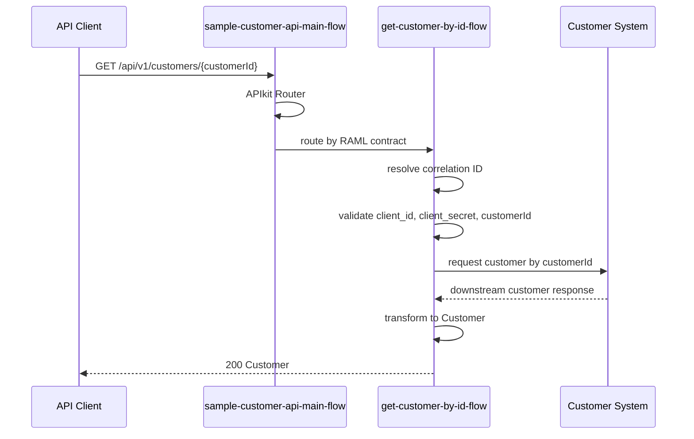

# Operation詳細設計: sample-customer-api-v1.customer.getById

このドキュメントは、`sample-customer-api-v1.customer.getById` のOperation別詳細設計です。

このドキュメント内のパスは、`applications/sample-domain-sapi-v1/` からの相対パスです。

## 1. Operation概要

| 項目 | 値 |
|---|---|
| Operation ID | `sample-customer-api-v1.customer.getById` |
| Method / Path | `GET /customers/{customerId}` |
| RAML | `raml/sample-customer-api/v1/resources/get_customer-get-by-id.raml` |
| Root RAML | `raml/sample-customer-api/v1/sample-customer-api.raml` |
| Flow | `get-customer-by-id-flow` |
| Request Headers | `client_id`, `client_secret` |
| Response Type | `Customer` |
| Error Model | `ErrorResponse` |

## 2. シーケンス図

## 3. Flow詳細

| 項目 | 値 |
|---|---|
| Flow | `get-customer-by-id-flow` |
| Entry | APIkit Routerから呼び出されるOperation flow |
| 入力 | headers, uriParams.customerId |
| 出力 | `Customer` payload |
| 共通Subflow | `common-correlation-id-subflow`, `common-logging-subflow` |

## 4. Processor表

| No | Processor | 目的 | 入力 | 出力 | Error |
|---:|---|---|---|---|---|
| 1 | Flow Reference | Correlation IDを解決する | headers | `vars.correlationId` | - |
| 2 | Logger | 開始ログを出力する | operationId, headers, path params | log event | - |
| 3 | Validation | 必須request headerを検証する | `attributes.headers.client_id`, `attributes.headers.client_secret` | - | `VALIDATION:*` |
| 4 | Validation | `customerId` を検証する | `attributes.uriParams.customerId` | - | `VALIDATION:*` |
| 5 | HTTP Request | Customer Systemから顧客情報を取得する | customerId | downstream response | `HTTP:*` |
| 6 | Transform Message | APIレスポンスを生成する | downstream response | `Customer` | `EXPRESSION` |
| 7 | Logger | 終了ログを出力する | status, elapsed time | log event | - |

## 5. DataWeave詳細

| DWL | 入力 | 出力 | 目的 |
|---|---|---|---|
| `src/main/resources/dwl/customer-get-by-id-response.dwl` | downstream customer response | `Customer` | 接続先項目をAPI typeへマッピングする |

## 6. Connector呼び出し詳細

| Connector | Config | 入力 | 出力 | Error |
|---|---|---|---|---|
| HTTP Request | `sample-http-request-config` | customerId | downstream response | `HTTP:NOT_FOUND`, `HTTP:TIMEOUT`, `HTTP:CONNECTIVITY`, `HTTP:*` |

## 7. Error処理

| Error Type | HTTP Status | Error Code | 備考 |
|---|---:|---|---|
| `VALIDATION:*` | 400 | `BAD_REQUEST` | headerまたはcustomerIdの入力値不正 |
| `HTTP:NOT_FOUND` | 404 | `RESOURCE_NOT_FOUND` | 接続先で対象顧客が存在しない |
| `HTTP:TIMEOUT` | 504 | `GATEWAY_TIMEOUT` | 接続先タイムアウト |
| `HTTP:CONNECTIVITY` | 503 | `SERVICE_UNAVAILABLE` | 接続先サービス利用不可 |
| `ANY` | 500 | `INTERNAL_ERROR` | 想定外の内部エラー |

## 8. MUnit観点

| Test | 目的 | Mock | Assert |
|---|---|---|---|
| `customer-get-by-id-success-test` | 正常応答 | HTTP Request | status 200 と `Customer` payload |
| `customer-get-by-id-validation-error-test` | customer IDまたは必須header不正 | なし | status 400 と `BAD_REQUEST` |
| `customer-get-by-id-not-found-test` | 接続先で対象なし | HTTP Request | status 404 と `RESOURCE_NOT_FOUND` |
| `customer-get-by-id-timeout-test` | 接続先タイムアウト | HTTP Request | status 504 と `GATEWAY_TIMEOUT` |
