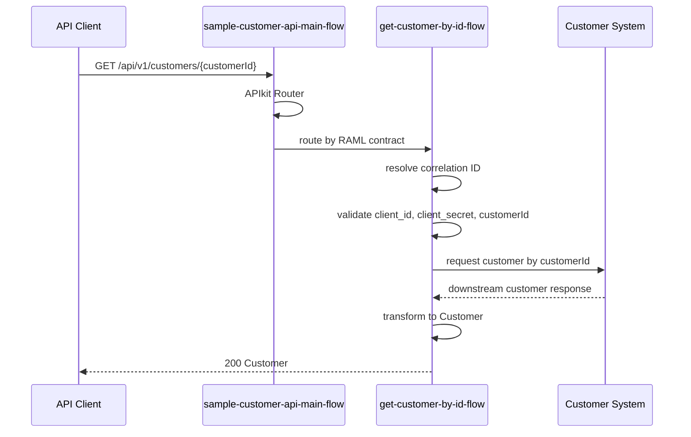

# Operation詳細設計: sample-customer-api-v1.customer.getById

このドキュメントは、`sample-customer-api-v1.customer.getById` のOperation別詳細設計です。

このドキュメント内のパスは、`applications/sample-domain-sapi-v1/` からの相対パスです。

## 1. Operation概要

| 項目 | 値 |
|---|---|
| Operation ID | `sample-customer-api-v1.customer.getById` |
| Method / Path | `GET /customers/{customerId}` |
| RAML | `raml/sample-customer-api/v1/resources/get_customer-get-by-id.raml` |
| Root RAML | `raml/sample-customer-api/v1/sample-customer-api.raml` |
| Flow | `get-customer-by-id-flow` |
| Request Headers | `client_id`, `client_secret` |
| Response Type | `Customer` |
| Error Model | `ErrorResponse` |

## 2. シーケンス図

## 3. Flow詳細

| 項目 | 値 |
|---|---|
| Flow | `get-customer-by-id-flow` |
| Entry | APIkit Routerから呼び出されるOperation flow |
| 入力 | headers, uriParams.customerId |
| 出力 | `Customer` payload |
| 共通Subflow | `common-correlation-id-subflow`, `common-logging-subflow` |

## 4. Processor表

| No | Processor | 目的 | 入力 | 出力 | Error |
|---:|---|---|---|---|---|
| 1 | Flow Reference | Correlation IDを解決する | headers | `vars.correlationId` | - |
| 2 | Logger | 開始ログを出力する | operationId, headers, path params | log event | - |
| 3 | Validation | 必須request headerを検証する | `attributes.headers.client_id`, `attributes.headers.client_secret` | - | `VALIDATION:*` |
| 4 | Validation | `customerId` を検証する | `attributes.uriParams.customerId` | - | `VALIDATION:*` |
| 5 | HTTP Request | Customer Systemから顧客情報を取得する | customerId | downstream response | `HTTP:*` |
| 6 | Transform Message | APIレスポンスを生成する | downstream response | `Customer` | `EXPRESSION` |
| 7 | Logger | 終了ログを出力する | status, elapsed time | log event | - |

## 5. DataWeave項目マッピング

この章では、最初にOperationで使用するDWLを一覧化し、その後にDWLごとの入力ソース、接続先モデル、APIレスポンスへの項目マッピングを記載します。

### 5.1 DWL一覧

| DWL | 種別 | 主な入力ソース | 出力 | 目的 |
|---|---|---|---|---|
| `src/main/resources/dwl/customer-get-by-id-response.dwl` | response mapping | Customer System customer response | `Customer` | 接続先項目をAPI typeへマッピングする |

### 5.2 `customer-get-by-id-response.dwl`

#### 5.2.1 入力ソース

| Source ID | Source | 取得元 | 概要 |
|---|---|---|---|
| `customerSystemResponse` | `payload` | Customer System `GET /customers/{customerId}` response | 顧客情報の接続先レスポンス |
| `correlationId` | `vars.correlationId` | `common-correlation-id-subflow` | エラー処理やログ追跡で使用する相関ID |

#### 5.2.2 接続先レスポンスモデル

| Field | Type | Required | 備考 |
|---|---|---:|---|
| `id` | string | true | Customer System上の顧客ID |
| `fullName` | string | true | 顧客氏名 |
| `statusCode` | string | true | `01`: 有効、`02`: 無効、その他: 不明 |
| `dateOfBirth` | string | false | `yyyy-MM-dd` 形式 |

#### 5.2.3 APIレスポンスマッピング

| Target field | Source | 変換規則 | Null / default | 備考 |
|---|---|---|---|---|
| `customerId` | `customerSystemResponse.id` | 文字列として設定する | 必須。nullの場合は `EXPRESSION` error | RAML `Customer.customerId` |
| `customerName` | `customerSystemResponse.fullName` | 文字列として設定する | 必須。nullの場合は `EXPRESSION` error | RAML `Customer.customerName` |
| `status` | `customerSystemResponse.statusCode` | `01` -> `ACTIVE`, `02` -> `INACTIVE`, その他 -> `UNKNOWN` | `UNKNOWN` | RAML `Customer.status` |
| `birthDate` | `customerSystemResponse.dateOfBirth` | `date-only` として設定する | nullの場合は項目を省略する | RAML `Customer.birthDate?` |

## 6. Connector呼び出し詳細

| 項目 | 値 |
|---|---|
| Connector | HTTP Request |
| Config | `sample-http-request-config` |
| Downstream system | Customer System |
| Method | GET |
| Path | `/customers/{customerId}` |
| Full URL | `https://${downstream.host}:${downstream.port}${downstream.basePath}/customers/{customerId}` |
| Response timeout | `${downstream.responseTimeoutMillis}` |
| Retry | なし |
| Request body | なし |
| Response body | downstream customer response |

| 種別 | 名前 | 値 / 変換規則 | 備考 |
|---|---|---|---|
| URI parameter | `customerId` | `attributes.uriParams.customerId` | API requestのpath parameter |
| Header | `X-Correlation-ID` | `vars.correlationId` | 接続先追跡用 |
| Header | `client_id`, `client_secret` | 転送しない | API Manager policy用のため接続先へ渡さない |

| Downstream status / error | Mule error | API response | 備考 |
|---|---|---|---|
| 200 | - | 200 `Customer` | 正常応答 |
| 404 | `HTTP:NOT_FOUND` | 404 `RESOURCE_NOT_FOUND` | 対象顧客なし |
| timeout | `HTTP:TIMEOUT` | 504 `GATEWAY_TIMEOUT` | `downstream.responseTimeoutMillis` 超過 |
| connectivity error | `HTTP:CONNECTIVITY` | 503 `SERVICE_UNAVAILABLE` | 接続先利用不可 |
| other `HTTP:*` | `HTTP:*` | 500 `INTERNAL_ERROR` | 想定外の接続先エラー |

## 7. Error処理

| Error Type | HTTP Status | Error Code | 備考 |
|---|---:|---|---|
| `VALIDATION:*` | 400 | `BAD_REQUEST` | headerまたはcustomerIdの入力値不正 |
| `HTTP:NOT_FOUND` | 404 | `RESOURCE_NOT_FOUND` | 接続先で対象顧客が存在しない |
| `HTTP:TIMEOUT` | 504 | `GATEWAY_TIMEOUT` | 接続先タイムアウト |
| `HTTP:CONNECTIVITY` | 503 | `SERVICE_UNAVAILABLE` | 接続先サービス利用不可 |
| `ANY` | 500 | `INTERNAL_ERROR` | 想定外の内部エラー |

## 8. MUnitテストケース詳細

| Test | 入力 | Mock | Assert |
|---|---|---|---|
| `customer-get-by-id-success-test` | `GET /api/v1/customers/C000001`、valid `client_id`、valid `client_secret` | HTTP Request returns 200 with `{ "id": "C000001", "fullName": "サンプル太郎", "statusCode": "01", "dateOfBirth": "1990-01-01" }` | HTTP status 200。payload.customerId=`C000001`、customerName=`サンプル太郎`、status=`ACTIVE`、birthDate=`1990-01-01`。HTTP Requestが1回呼ばれる |
| `customer-get-by-id-validation-error-test` | `GET /api/v1/customers/C000001`、invalid or missing `client_id` / `client_secret` | なし | HTTP status 400。payload.code=`BAD_REQUEST`。HTTP Requestが呼ばれない |
| `customer-get-by-id-not-found-test` | `GET /api/v1/customers/C999999`、valid headers | HTTP Request raises `HTTP:NOT_FOUND` | HTTP status 404。payload.code=`RESOURCE_NOT_FOUND` |
| `customer-get-by-id-timeout-test` | `GET /api/v1/customers/C000001`、valid headers | HTTP Request raises `HTTP:TIMEOUT` | HTTP status 504。payload.code=`GATEWAY_TIMEOUT` |
