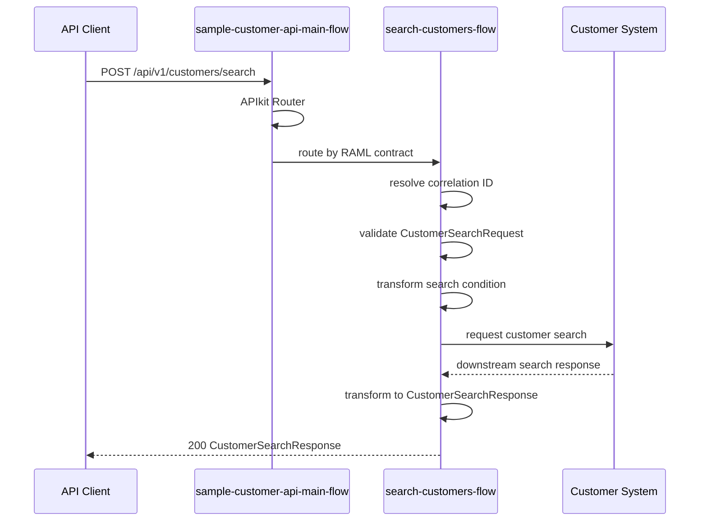

# Operation詳細設計: sample-customer-api-v1.customer.search

このドキュメントは、`sample-customer-api-v1.customer.search` のOperation別詳細設計です。

このドキュメント内のパスは、`applications/sample-domain-sapi-v1/` からの相対パスです。

## 1. Operation概要

| 項目 | 値 |
|---|---|
| Operation ID | `sample-customer-api-v1.customer.search` |
| Method / Path | `POST /customers/search` |
| RAML | `raml/sample-customer-api/v1/resources/post_customer-search.raml` |
| Root RAML | `raml/sample-customer-api/v1/sample-customer-api.raml` |
| Flow | `search-customers-flow` |
| Request Type | `CustomerSearchRequest` |
| Response Type | `CustomerSearchResponse` |
| Error Model | `ErrorResponse` |

## 2. シーケンス図

## 3. Flow詳細

| 項目 | 値 |
|---|---|
| Flow | `search-customers-flow` |
| Entry | APIkit Routerから呼び出されるOperation flow |
| 入力 | headers, `CustomerSearchRequest` payload |
| 出力 | `CustomerSearchResponse` payload |
| 共通Subflow | `common-correlation-id-subflow`, `common-logging-subflow` |

## 4. Processor表

| No | Processor | 目的 | 入力 | 出力 | Error |
|---:|---|---|---|---|---|
| 1 | Flow Reference | Correlation IDを解決する | headers | `vars.correlationId` | - |
| 2 | Logger | 開始ログを出力する | operationId, body | log event | - |
| 3 | Validation | request bodyを検証する | payload | - | `VALIDATION:*` |
| 4 | Transform Message | Customer System向け検索条件を生成する | `CustomerSearchRequest` | downstream search request | `EXPRESSION` |
| 5 | HTTP Request | Customer Systemで顧客を検索する | downstream search request | downstream response | `HTTP:*` |
| 6 | Transform Message | APIレスポンスを生成する | downstream response | `CustomerSearchResponse` | `EXPRESSION` |
| 7 | Logger | 終了ログを出力する | status, elapsed time | log event | - |

## 5. DataWeave項目マッピング

この章では、最初にOperationで使用するDWLを一覧化し、その後にDWLごとの入力ソース、接続先リクエスト、接続先レスポンス、APIレスポンスへの項目マッピングを記載します。

### 5.1 DWL一覧

| DWL | 種別 | 主な入力ソース | 出力 | 目的 |
|---|---|---|---|---|
| `src/main/resources/dwl/customer-search-request.dwl` | request mapping | API request `CustomerSearchRequest` | downstream search request | 検索条件を接続先向けに正規化する |
| `src/main/resources/dwl/customer-search-response.dwl` | response mapping | Customer System search response | `CustomerSearchResponse` | 接続先の検索結果をAPI typeへマッピングする |

### 5.2 `customer-search-request.dwl`

#### 5.2.1 入力ソース

| Source ID | Source | 取得元 | 概要 |
|---|---|---|---|
| `apiRequest` | `payload` | API request body | RAML `CustomerSearchRequest` |
| `correlationId` | `vars.correlationId` | `common-correlation-id-subflow` | 接続先headerやログ追跡で使用する相関ID |

#### 5.2.2 接続先リクエストマッピング

| Downstream field | Source | 変換規則 | Null / default | 備考 |
|---|---|---|---|---|
| `nameLike` | `apiRequest.customerName` | 前後空白を除去して設定する | nullの場合は項目を省略する | 部分一致検索条件 |
| `statusCode` | `apiRequest.status` | `ACTIVE` -> `01`, `INACTIVE` -> `02` | nullの場合は項目を省略する | Customer Systemのステータスコード |
| `limit` | `apiRequest.limit` | integerとして設定する | nullの場合は `20` | RAML上の最大値は100 |

### 5.3 `customer-search-response.dwl`

#### 5.3.1 入力ソース

| Source ID | Source | 取得元 | 概要 |
|---|---|---|---|
| `customerSystemResponse` | `payload` | Customer System `POST /customers/search` response | 顧客検索結果の接続先レスポンス |

#### 5.3.2 接続先レスポンスモデル

| Field | Type | Required | 備考 |
|---|---|---:|---|
| `total` | integer | true | 検索結果の総件数 |
| `items[].id` | string | true | Customer System上の顧客ID |
| `items[].fullName` | string | true | 顧客氏名 |
| `items[].statusCode` | string | true | `01`: 有効、`02`: 無効、その他: 不明 |
| `items[].dateOfBirth` | string | false | `yyyy-MM-dd` 形式 |

#### 5.3.3 APIレスポンスマッピング

| Target field | Source | 変換規則 | Null / default | 備考 |
|---|---|---|---|---|
| `totalCount` | `customerSystemResponse.total` | integerとして設定する | 必須。nullの場合は `0` | RAML `CustomerSearchResponse.totalCount` |
| `customers` | `customerSystemResponse.items` | 配列として設定する | nullの場合は空配列 | RAML `CustomerSearchResponse.customers` |
| `customers[].customerId` | `customerSystemResponse.items[].id` | 文字列として設定する | 必須。nullの場合は `EXPRESSION` error | RAML `Customer.customerId` |
| `customers[].customerName` | `customerSystemResponse.items[].fullName` | 文字列として設定する | 必須。nullの場合は `EXPRESSION` error | RAML `Customer.customerName` |
| `customers[].status` | `customerSystemResponse.items[].statusCode` | `01` -> `ACTIVE`, `02` -> `INACTIVE`, その他 -> `UNKNOWN` | `UNKNOWN` | RAML `Customer.status` |
| `customers[].birthDate` | `customerSystemResponse.items[].dateOfBirth` | `date-only` として設定する | nullの場合は項目を省略する | RAML `Customer.birthDate?` |

## 6. Connector呼び出し詳細

| 項目 | 値 |
|---|---|
| Connector | HTTP Request |
| Config | `sample-http-request-config` |
| Downstream system | Customer System |
| Method | POST |
| Path | `/customers/search` |
| Full URL | `https://${downstream.host}:${downstream.port}${downstream.basePath}/customers/search` |
| Response timeout | `${downstream.responseTimeoutMillis}` |
| Retry | なし |
| Request body | downstream search request |
| Response body | downstream search response |

| 種別 | 名前 | 値 / 変換規則 | 備考 |
|---|---|---|---|
| Header | `X-Correlation-ID` | `vars.correlationId` | 接続先追跡用 |
| Header | `Content-Type` | `application/json` | JSON request |
| Body | - | `customer-search-request.dwl` の出力 | Customer System向け検索条件 |

| Downstream status / error | Mule error | API response | 備考 |
|---|---|---|---|
| 200 | - | 200 `CustomerSearchResponse` | 正常応答 |
| timeout | `HTTP:TIMEOUT` | 504 `GATEWAY_TIMEOUT` | `downstream.responseTimeoutMillis` 超過 |
| connectivity error | `HTTP:CONNECTIVITY` | 503 `SERVICE_UNAVAILABLE` | 接続先利用不可 |
| other `HTTP:*` | `HTTP:*` | 500 `INTERNAL_ERROR` | 想定外の接続先エラー |

## 7. Error処理

| Error Type | HTTP Status | Error Code | 備考 |
|---|---:|---|---|
| `VALIDATION:*` | 400 | `BAD_REQUEST` | request bodyの入力値不正 |
| `HTTP:TIMEOUT` | 504 | `GATEWAY_TIMEOUT` | 接続先タイムアウト |
| `HTTP:CONNECTIVITY` | 503 | `SERVICE_UNAVAILABLE` | 接続先サービス利用不可 |
| `ANY` | 500 | `INTERNAL_ERROR` | 接続先または内部エラー |

## 8. MUnitテストケース詳細

| Test | 入力 | Mock | Assert |
|---|---|---|---|
| `customer-search-success-test` | `POST /api/v1/customers/search`、payload `{ "customerName": "サンプル", "status": "ACTIVE", "limit": 20 }` | HTTP Request returns 200 with `{ "total": 1, "items": [{ "id": "C000001", "fullName": "サンプル太郎", "statusCode": "01", "dateOfBirth": "1990-01-01" }] }` | HTTP status 200。payload.totalCount=`1`。payload.customers[0].customerId=`C000001`、status=`ACTIVE`。HTTP Request body has `nameLike=サンプル`, `statusCode=01`, `limit=20` |
| `customer-search-validation-error-test` | `POST /api/v1/customers/search`、payload `{ "status": "INVALID" }` | なし | HTTP status 400。payload.code=`BAD_REQUEST`。HTTP Requestが呼ばれない |
| `customer-search-system-error-test` | `POST /api/v1/customers/search`、valid payload | HTTP Request raises `HTTP:CONNECTIVITY` or `HTTP:*` | `HTTP:CONNECTIVITY` の場合はstatus 503、その他の内部エラーはstatus 500。payloadは `ErrorResponse` |
