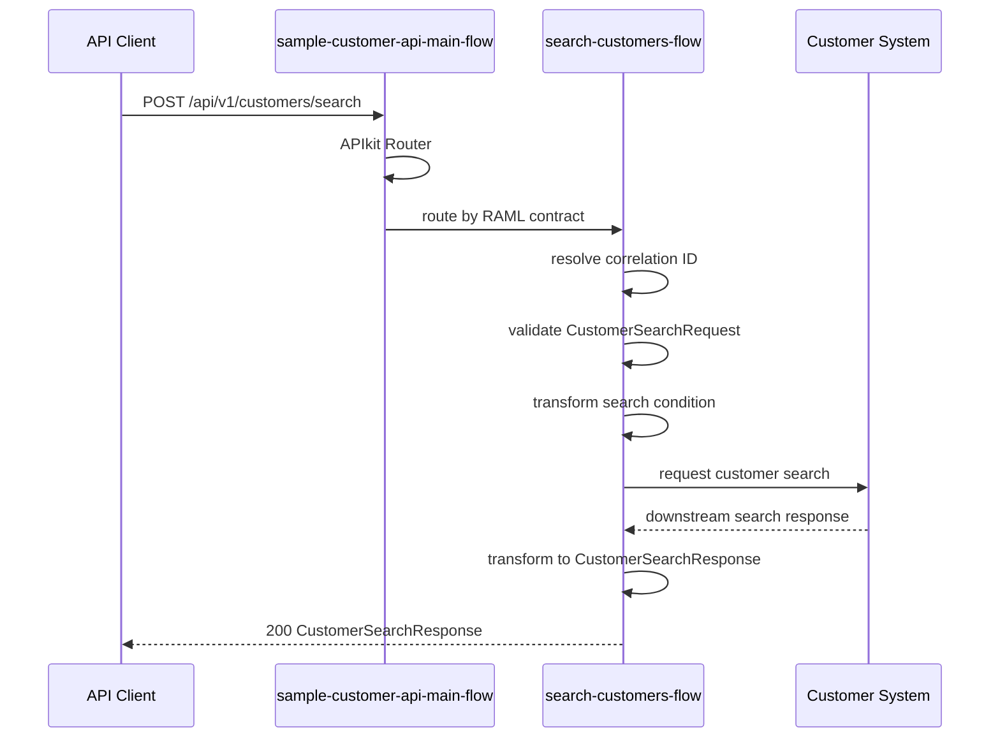

# Operation詳細設計: sample-customer-api-v1.customer.search

このドキュメントは、`sample-customer-api-v1.customer.search` のOperation別詳細設計です。

このドキュメント内のパスは、`applications/sample-domain-sapi-v1/` からの相対パスです。

## 1. Operation概要

| 項目 | 値 |
|---|---|
| Operation ID | `sample-customer-api-v1.customer.search` |
| Method / Path | `POST /customers/search` |
| RAML | `raml/sample-customer-api/v1/resources/post_customer-search.raml` |
| Root RAML | `raml/sample-customer-api/v1/sample-customer-api.raml` |
| Flow | `search-customers-flow` |
| Request Type | `CustomerSearchRequest` |
| Response Type | `CustomerSearchResponse` |
| Error Model | `ErrorResponse` |

## 2. シーケンス図

## 3. Flow詳細

| 項目 | 値 |
|---|---|
| Flow | `search-customers-flow` |
| Entry | APIkit Routerから呼び出されるOperation flow |
| 入力 | headers, `CustomerSearchRequest` payload |
| 出力 | `CustomerSearchResponse` payload |
| 共通Subflow | `common-correlation-id-subflow`, `common-logging-subflow` |

## 4. Processor表

| No | Processor | 目的 | 入力 | 出力 | Error |
|---:|---|---|---|---|---|
| 1 | Flow Reference | Correlation IDを解決する | headers | `vars.correlationId` | - |
| 2 | Logger | 開始ログを出力する | operationId, body | log event | - |
| 3 | Validation | request bodyを検証する | payload | - | `VALIDATION:*` |
| 4 | Transform Message | Customer System向け検索条件を生成する | `CustomerSearchRequest` | downstream search request | `EXPRESSION` |
| 5 | HTTP Request | Customer Systemで顧客を検索する | downstream search request | downstream response | `HTTP:*` |
| 6 | Transform Message | APIレスポンスを生成する | downstream response | `CustomerSearchResponse` | `EXPRESSION` |
| 7 | Logger | 終了ログを出力する | status, elapsed time | log event | - |

## 5. DataWeave詳細

| DWL | 入力 | 出力 | 目的 |
|---|---|---|---|
| `src/main/resources/dwl/customer-search-request.dwl` | `CustomerSearchRequest` | downstream search request | 検索条件を正規化する |
| `src/main/resources/dwl/customer-search-response.dwl` | downstream search response | `CustomerSearchResponse` | 一覧結果をマッピングする |

## 6. Connector呼び出し詳細

| Connector | Config | 入力 | 出力 | Error |
|---|---|---|---|---|
| HTTP Request | `sample-http-request-config` | downstream search request | downstream response | `HTTP:TIMEOUT`, `HTTP:CONNECTIVITY`, `HTTP:*` |

## 7. Error処理

| Error Type | HTTP Status | Error Code | 備考 |
|---|---:|---|---|
| `VALIDATION:*` | 400 | `BAD_REQUEST` | request bodyの入力値不正 |
| `HTTP:TIMEOUT` | 504 | `GATEWAY_TIMEOUT` | 接続先タイムアウト |
| `HTTP:CONNECTIVITY` | 503 | `SERVICE_UNAVAILABLE` | 接続先サービス利用不可 |
| `ANY` | 500 | `INTERNAL_ERROR` | 接続先または内部エラー |

## 8. MUnit観点

| Test | 目的 | Mock | Assert |
|---|---|---|---|
| `customer-search-success-test` | 正常応答 | HTTP Request | status 200 と `CustomerSearchResponse` payload |
| `customer-search-validation-error-test` | request body不正 | なし | status 400 と `BAD_REQUEST` |
| `customer-search-system-error-test` | 接続先または内部エラー | HTTP Request | status 500 または 503 の `ErrorResponse` |
